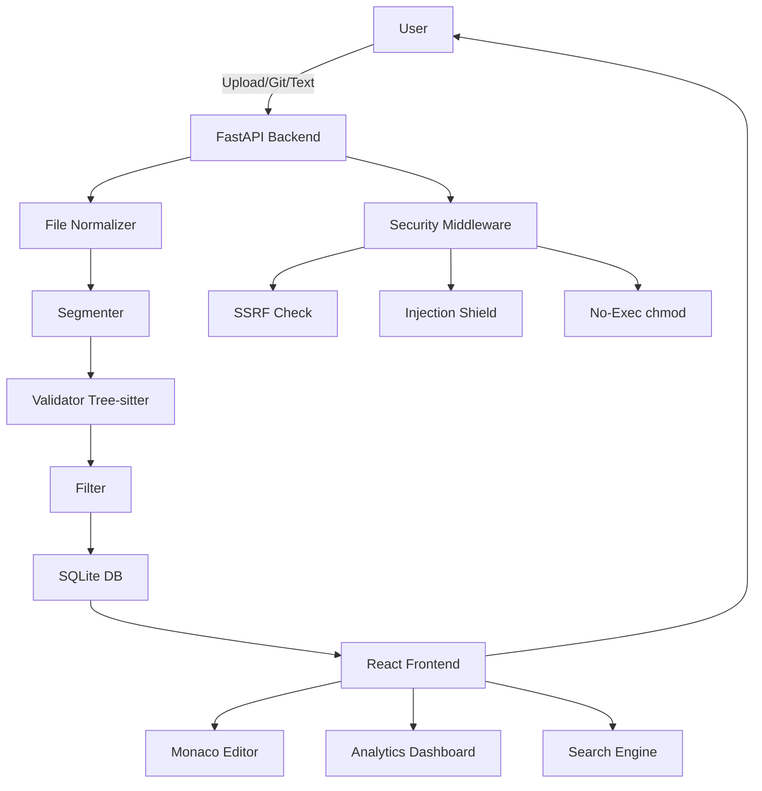

<div align="center">

# 🛡️ SENTINEL

### **Advanced Code & Data Extraction System with Military-Grade Security**

[](https://fastapi.tiangolo.com/)
[](https://reactjs.org/)
[](https://www.python.org/)
[](LICENSE)

**S**entinel **E**xtraction **N**etwork **T**echnology **I**ntelligence **N**ode **E**ngine **L**ogic

*Hybrid-Professional Extraction System with Enterprise-Level Security*

[📖 Documentation](#-documentation) • [🚀 Quick Start](#-quick-start) • [✨ Features](#-features) • [🔒 Security](#-security) • [🎯 API](#-api)

</div>

---

## 📋 Table of Contents

- [Overview](#-overview)
- [Key Features](#-features)
- [Quick Start](#-quick-start)
- [Architecture](#-architecture)
- [Security Features](#-security)
- [API Documentation](#-api)
- [Technology Stack](#-technology-stack)
- [Screenshots](#-screenshots)
- [Contributing](#-contributing)
- [License](#-license)

---

## 🎯 Overview

**SENTINEL** is a state-of-the-art, full-stack application designed for intelligent extraction of code blocks and structured data from diverse sources. Built with a **security-first mindset**, it combines advanced NLP techniques, AST-based validation, and enterprise-grade protection mechanisms to deliver accurate, safe, and production-ready extraction.

### 🌟 Why SENTINEL?

| Feature | SENTINEL | Traditional Tools |
|---------|-----------|-------------------|
| **Multi-Source Input** | ✅ Files, URLs, Git Repos, Text | ❌ Limited to files |
| **AST Validation** | ✅ Tree-sitter for 15+ languages | ❌ Regex-only |
| **Security Hardening** | ✅ SSRF, Injection, No-Exec | ❌ Basic validation |
| **Real-time Analytics** | ✅ Dashboard with trends | ❌ No analytics |
| **Interactive Editing** | ✅ Monaco Editor integration | ❌ View-only |
| **Export Flexibility** | ✅ Categorized ZIP + JSON | ❌ Raw text dump |

---

## ✨ Features

### 🔍 **Core Extraction Engine**

#### **Hybrid Intelligence**
- **Three-Stage Pipeline:**
  1. **Segmentation:** Markdown fence detection → Indentation analysis → Density scoring
  2. **Validation:** Tree-sitter AST (15 languages) → Pattern matching (configs) → Schema validation (JSON/YAML)
  3. **Filtering:** Size thresholds → Inline detection → Syntax integrity checks

#### **Supported Languages & Formats**
```yaml
Programming Languages (Tree-sitter AST):
  - Python, JavaScript, TypeScript, Java, C, C++, Go, Rust
  - Ruby, PHP, C#, Kotlin, Bash, SQL, HTML, CSS

Configuration & Structured Data:
  - JSON, YAML, XML, TOML, Dockerfile, CSV
  - Cisco IOS, Nginx configs

Document Formats:
  - PDF, DOCX, TXT, Markdown
```

---

### 🌐 **Multi-Source Import**

#### **1. File Upload**
- Drag-and-drop interface with glassmorphic design
- SHA-256 deduplication (prevents redundant processing)
- **New:** Support for `.html`, `.css`, `.json`, `.sql` files

#### **2. Git Repository Analysis**
- **One-Click Import:** Paste any GitHub URL (supports branches)
- **Smart Estimation:** Real-time calculation analysis time
- **⏩ Fast Forward:** Intelligent polling system that detects early completion and lets you skip the countdown immediately.
- **Cinematic Feedback:** Holographic terminal with cyber-security themed animations

#### **3. Direct Text Input**
- Paste code/markdown directly into the system
- Instant extraction without file creation

---

### 🎨 **Premium User Experience**

#### **⚡ Command+K Spotlight**
- **Global Navigation:** Press `Cmd+K` (Mac) or `Ctrl+K` (Windows) anywhere to open the command palette.
- **Instant Actions:** Jump to pages, toggle themes, or run quick extractions.
- **Developer Friendly:** Keyboard-first design for power users.

#### **Glassmorphic Dark Theme**
- Semi-transparent cards with backdrop blur
- Language-specific gradient accents (Python: Blue→Cyan, JavaScript: Yellow→Orange)
- Smooth micro-animations (float, glow, shimmer effects)
- Custom Inter font family for professional typography

#### **Interactive Components**
- **Monaco Editor:** Full-featured code editor (same as VS Code)
- **Split View:** Resizable panels to compare original vs extracted content
- **Regex Guide:** Built-in cheat sheet for advanced search queries (click `?` in search).

---

### 📊 **Analytics Dashboard**

Real-time system insights powered by **Recharts**:
- **Overview Stats:** Total files, blocks, average confidence, active languages
- **Trend Analysis:** 7-day extraction activity with area charts
- **Language Distribution:** Donut charts showing language breakdown by percentage
- **Top Files:** Leaderboard of most code-dense files

---

### 🔎 **Advanced Search Engine**

Powerful full-text search with instant results:
- **Filters:** Language, Confidence Score (0-100%), Date Range
- **Bulk Actions:** Multi-select deletion for cleanup
- **Export Results:** Download search results as JSON for reporting
- **Quick Copy:** One-click copy-to-clipboard for every code block
- **Inline Editing:** Modify code directly in search view with Monaco Editor

---

### 🔒 **Security**

#### **Enterprise-Grade Protection**

##### 🛡️ **Input Sanitization**
- **Filename Cleaning:** NFKD normalization + unsafe character removal
- **Path Containment:** Strict validation to prevent `../../` traversal attacks
- **Protocol Whitelisting:** Only `http://` and `https://` allowed for Git URLs

##### 🚫 **SSRF (Server-Side Request Forgery) Prevention**
```python
# Blocks localhost and private networks
Blocked: http://localhost:8002/admin
Blocked: http://192.168.1.1/config
Blocked: http://10.0.0.1/internal
✅ Allowed: https://github.com/user/repo.git
```

##### 💉 **Command Injection Shield**
```python
# Regex validation rejects shell metacharacters
Blocked: https://github.com/foo/bar; rm -rf /
Blocked: https://evil.com/repo|nc attacker.com
✅ Allowed: https://github.com/user/valid-repo.git
```

##### 🔐 **No-Execute Policy**
- All uploaded files: `chmod 644` (read-only, non-executable)
- All cloned repos: Recursive `chmod 755` (dirs) / `644` (files)
- **Result:** Zero risk of malicious script execution

##### 🛡️ **Security Headers**
```http
X-Content-Type-Options: nosniff
X-Frame-Options: DENY
X-XSS-Protection: 1; mode=block
Strict-Transport-Security: max-age=31536000; includeSubDomains
Referrer-Policy: strict-origin-when-cross-origin
```

##### 🎭 **Error Masking**
- Global exception handler masks stack traces in production
- Returns generic "Internal Server Error" to users
- Full error logging on backend for debugging

---

### 🗂️ **Categorized Export**

ZIP structure with intelligent organization:
```
extraction_12Jan2024.zip
├── python_codes/
│   ├── script_1.py
│   └── module_2.py
├── javascript_codes/
│   ├── app.js
│   └── utils.js
├── configs/
│   ├── config.json
│   └── settings.yaml
├── logs/
│   └── server.log
├── structured/
│   └── data.xml
└── metadata.json  # Extraction statistics
```

---

### 🎯 **System Management**

#### **Danger Zone** (Dashboard)
- **Reset System:** Admin-level button to wipe all data
- **Double Confirmation:** Prevents accidental deletion
- **Complete Cleanup:** Deletes database + uploaded files + cloned repos

---

## 🚀 Quick Start

### Prerequisites

```bash
# Required
- Python 3.10+
- Node.js 18+
- npm 9+

# Optional (for Docker deployment)
- Docker 24+
- Docker Compose 2.0+
```

### Option 1: One-Command Startup (Recommended)

```bash
git clone https://github.com/yourusername/SENTINEL.git
cd SENTINEL
./start_local.sh
```

**Access:**
- 🌐 Frontend: [http://localhost:5173](http://localhost:5173)
- 🔧 Backend API: [http://localhost:8002/docs](http://localhost:8002/docs)

### Option 2: Docker Deployment

```bash
docker-compose up --build
```

**Access:**
- 🌐 Frontend: [http://localhost:3000](http://localhost:3000)
- 🔧 Backend API: [http://localhost:8002/docs](http://localhost:8002/docs)

### Option 3: Manual Setup

#### Backend
```bash
cd backend
python3 -m venv venv
source venv/bin/activate  # Windows: venv\Scripts\activate
pip install -r requirements.txt
uvicorn app.main:app --reload --port 8002
```

#### Frontend
```bash
cd frontend
npm install
npm run dev
```

---

## 🏗️ Architecture

### High-Level Overview



### Backend Components

| Component | Responsibility | Technology |
|-----------|---------------|------------|
| **Normalizer** | Extract text from PDF/DOCX/TXT | PyMuPDF, python-docx |
| **Segmenter** | Detect code blocks via Markdown/Indentation/Density | Regex + Heuristics |
| **Validator** | AST parsing for syntax verification | Tree-sitter (15 languages) |
| **Filter** | Remove false positives | Custom algorithms |
| **Git Service** | Clone & analyze repositories | GitPython + Security checks |
| **Security** | SSRF/Injection prevention | URL parsing + IP validation |

### Frontend Components

| Component | Purpose |
|-----------|---------|
| **FileUpload** | Drag-and-drop with animations |
| **GitImport** | Repository URL input with estimation |
| **SplitView** | Original vs Extracted comparison |
| **CodeCard** | Glassmorphic block display |
| **MonacoEditor** | VS Code-level editing |
| **Dashboard** | Analytics with Recharts |
| **SearchPage** | Full-text search with filters |

---

## 🔧 Technology Stack

### Backend
```yaml
Framework: FastAPI 0.104+
Language: Python 3.10+
ORM: SQLAlchemy 2.0
Database: SQLite (Production: PostgreSQL ready)
Parsing: Tree-sitter 0.20+
PDF: PyMuPDF 1.23+
DOCX: python-docx 1.0+
Git: GitPython 3.1+
Security: ipaddress (stdlib), regex
```

### Frontend
```yaml
Framework: React 18.2+
Build Tool: Vite 5.0+
Styling: TailwindCSS 3.3+
Charts: Recharts 3.7+
Editor: Monaco Editor 4.6+
UI Icons: Lucide React 0.263+
HTTP: Axios 1.6+
```

### DevOps
```yaml
Containerization: Docker + Docker Compose
Reverse Proxy: Nginx (frontend serving)
Process Manager: Uvicorn (backend)
Development: Hot reload (--reload)
```

---

## 📖 API

**Interactive Documentation:** [http://localhost:8002/docs](http://localhost:8002/docs)

### Core Endpoints

#### **Upload File**
```http
POST /api/upload
Content-Type: multipart/form-data

Body: file=<binary>

Response:
{
  "file_id": 42,
  "filename": "document.pdf",
  "file_hash": "abc123...",
  "file_size": 204800,
  "message": "File uploaded successfully"
}
```

#### **Extract Blocks**
```http
POST /api/extract/{file_id}

Response:
{
  "file_id": 42,
  "total_blocks": 15,
  "blocks": [
    {
      "block_id": 1,
      "content": "def hello(): ...",
      "language": "python",
      "confidence_score": 0.95,
      "start_line": 10,
      "end_line": 15
    }
  ]
}
```

#### **Advanced Search**
```http
GET /api/search?q=function&languages=python,javascript&min_confidence=0.8

Response:
{
  "total_results": 42,
  "results": [...]
}
```

#### **Git Analysis**
```http
POST /api/git/analyze
Content-Type: application/json

Body:
{
  "repo_url": "https://github.com/user/repo.git",
  "branch": "main"  // optional
}

Response:
{
  "session_id": 10,
  "total_files": 127,
  "total_blocks": 543,
  "files": [...]
}
```

#### **Analytics**
```http
GET /api/analytics/overview

Response:
{
  "total_files": 150,
  "total_blocks": 1234,
  "avg_confidence": 0.87,
  "language_distribution": [
    {"language": "python", "count": 500, "percentage": 40.5},
    {"language": "javascript", "count": 300, "percentage": 24.3}
  ]
}
```

#### **System Reset** (⚠️ Danger Zone)
```http
DELETE /api/system/reset

Response: 204 No Content
Effect: Deletes ALL data and files
```

**Full API Guide:** [backend/API_GUIDE.md](backend/API_GUIDE.md)

---

## 📸 Screenshots

> *Screenshots can be added here after deployment*

### Dashboard


### File Upload


### Git Import


### Search & Edit


---

## 🤝 Contributing

We welcome contributions! Please follow these guidelines:

1. **Fork** the repository
2. **Create** a feature branch (`git checkout -b feature/AmazingFeature`)
3. **Commit** your changes (`git commit -m 'Add AmazingFeature'`)
4. **Push** to the branch (`git push origin feature/AmazingFeature`)
5. **Open** a Pull Request

### Code Standards
- Backend: PEP 8 (Python)
- Frontend: ESLint + Prettier
- Commit messages: Conventional Commits

---

## 📜 License

This project is licensed under the **MIT License** - see the [LICENSE](LICENSE) file for details.

---

## 🙏 Acknowledgments

- **Tree-sitter** team for amazing parsing libraries
- **FastAPI** for blazing-fast Python framework
- **Monaco Editor** for VS Code-level editing
- **TailwindCSS** for utility-first styling
- **Recharts** for beautiful data visualization

---

## 📊 Project Stats

```yaml
Total Lines of Code: ~15,000+
Backend Files: 25+
Frontend Components: 15+
API Endpoints: 30+
Supported Languages: 15+
Security Checks: 5 layers
Development Time: 16 phases of continuous improvement
```

---

## 🚀 Roadmap

- [x] Core Extraction Engine (v1.0)
- [x] Git Repository Import (v2.0)
- [x] Analytics Dashboard (v2.0)
- [x] Advanced Search (v2.0)
- [x] Security Hardening (v2.1)
- [ ] PostgreSQL Support (v2.2)
- [ ] User Authentication (v2.3)
- [ ] API Rate Limiting (v2.3)
- [ ] Kubernetes Deployment (v3.0)

---

<div align="center">

### **Built with ❤️ by the SENTINEL Team**

⭐ **Star this repo if you find it useful!**

[Report Bug](https://github.com/yourusername/SENTINEL/issues) • [Request Feature](https://github.com/yourusername/SENTINEL/issues)

</div>